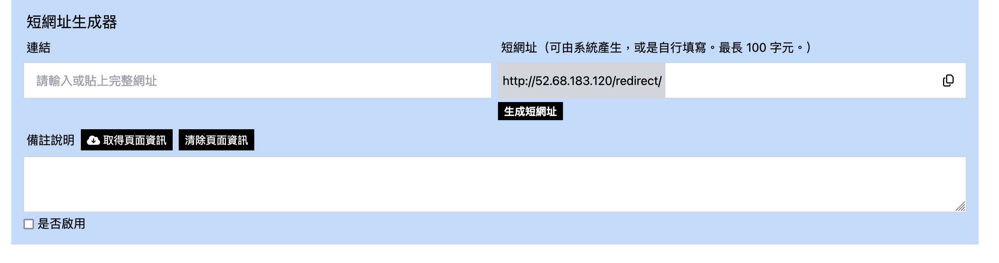
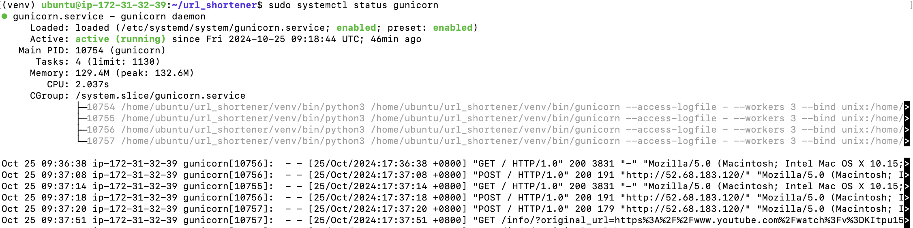
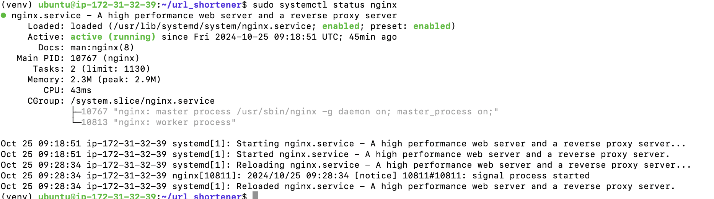

# 短網址生成器

 
網站連結：http://52.68.183.120/

## 使用方法

1. 可由系統生成，或是自行輸入短網址。
2. 第一次按下使否啟用前，短網址均未存入資料庫中。按下後，狀態即預設為已啟用，再按掉頂多是將狀態改為未啟用，但資料庫中依舊存有該筆資訊。
3. 一個原網址可對應多個短網址，但一個短網址只會對到一個原網址。其他原網址無法搶走該短網址，就算短網址處於未啟用狀態。
4. 勾選開啟使用後，即會提示是否可以使用該短網址。假如原網址配上已配對過的短網址時，並不會額外提醒，只會告知現在短網址使否已啟用。
5. 取得頁面資訊將顯示原網址的相關資訊。

## 使用技術

1. 部署： Gunicorn, Nginx, EC2
2. 前端： Alpine.js, HTMX, Tailwind CSS
3. 後端： Django, sqlite3

Gunicorn 運行截圖：

Nginx 運行截圖：

